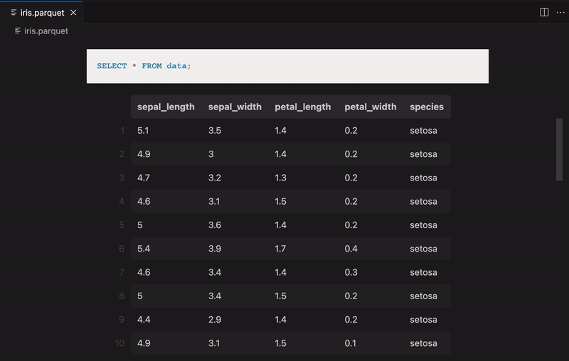

# Parquet Explorer

### Explore Parquet files with SQL

Parquet Explorer is a VSCode extension that provides a preview of and SQL query
exceution against Apache Parquet files. Under the hood, SQL queries are executed
by [DuckDB](https://duckdb.org/), which implements efficient partial reading and
parallel query processing.

# Quick Start

1. Install the [Parquet Explorer extension](https://marketplace.visualstudio.com/items?itemName=AdamViola.parquet-explorer)
from the marketplace.

2. Open a Parquet (.parquet) file and the extension will activate.